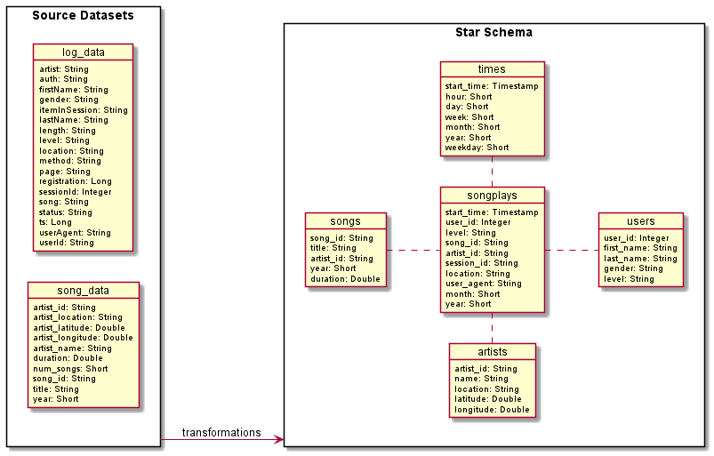
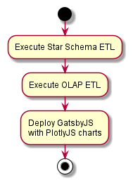

Hi, my name is Rafael Dutra, and in this project, I intended to improve my skills learned from the Data Engineering Course at Udacity. I enjoyed working with Spark and the other technologies used here, so I hope you like it.

## Project introduction
This project is an exercise I have done for the Data Engineering Course at Udacity. The core idea of the activity is to build an ETL pipeline using the Pyspark framework to extract data from an S3 bucket, create tables based on the star schema, and save those tables in another S3 bucket.\
At the beginning of the activity, two datasets are available, the song dataset and the log dataset.\
The song dataset is a subset of data from the [Million Song Dataset](https://labrosa.ee.columbia.edu/millionsong/). This dataset contains metadata about songs and the artists of those songs.\
The log dataset consists of log files of users' activities from imaginary music streaming app, generated by an [event simulator](https://github.com/Interana/eventsim) based on the Million Song Dataset.\
The diagram below shows the schema of source datasets and the desired schema after transformations.



And the activity diagram below shows the available steps developed.



### What you will find here
I created the proposed ETL using python scripts. For tests purposes, I ran it in a local environment set up with Kubernetes and in an AWS Elastic MapReduce (EMR) cluster.\
For the k8s environment, I've installed the [Minio Operator](https://github.com/minio/operator) to place the simple storage service (S3) role and the [Spark on K8s Operator](https://github.com/GoogleCloudPlatform/spark-on-k8s-operator) to manage Spark applications.\
In this way, you will find in the project's Github repository the below root structure.

Main files:

- **sparkify_star_schema_etl**: Python module created to get the log and songs data, transform and save the data to tables in the Star Schema.
- **etl.py**: Main script responsible for selecting and starting one of the ETL modules created.
- **setup.py**: Python script responsible for configuring the project package creation.
- **dl.cfg.example**: Example of how to create the configuration file to run the ETL with Spark in standalone mode. For standalone mode duplicate this file removing .example and set the S3 AWS credentials.

Additional files (olap_etl module and example files):

- **sparkify_olap_etl**: This python module is responsible for querying OLAP cubes from tables created by sparkify_star_schema_etl and saving them to an s3 bucket.
- **docs**: The documentation is responsible for looking for docstrings in the python files and extracting them. It also takes care of render charts of the data saved by the OLAP module. The result is a static website powered by [Gatsby.js](https://www.gatsbyjs.com), created to help get started with the project.
- **notebooks**: Jupyter Notebooks are used here for tests and analysis purposes.
- **plantuml**: Plant UML diagrams.
- **shell_scripts**: Bash scripts examples to create EMR clusters to run the created ETLs. 
- **sparkconf.cfg.exemple**: Example of how to create the configuration file used in the Jupyter Notebooks to set SparkConf.


And, in the [documentation pages](https://dutrajardim.github.io/udacity-dl-project), the following navigation links are available:

- **Home**: The README.md file in the root repository directory.
- **Docstrings**: The documentation of the python functions based in their docstrings.
- **Charts**: Charts examples created from the result of sparkify_olap_etl module.

### Spark in Standalone mode

#### Installation
Download the project source code and create a virtual python environment (using python >= 3.5) with the following commands in the Linux shell console.

```console
$ git clone https://github.com/dutrajardim/udacity-dl-project.git
$ ...
$ cd udacity-dl-project
$ python -m venv .venv
$ ...
$ source .venv/bin/activate
$ python setup.py install
$ ...
```

#### How to use
To run etl.py with Spark in standalone mode no arguments is needed. Set the df.cfg file with AWS S2 credentials in the root file and execute the etl.py script.

```console
$ python etl.py
```

### Spark with Yarn or Kurbernates
#### Installation
Download the project source code and create a virtual python environment (using python >= 3.5) with the following commands in the Linux shell console.


```console
$ git clone https://github.com/dutrajardim/udacity-dl-project.git
$ ...
$ cd udacity-dl-project
$ python -m venv .venv
$ ...
$ source .venv/bin/activate
```

To compile python dependencies as a package file that can be sent to the Spark cluster, you can run the command below. It's going to generate an egg file in the dist folder. This file we can set as an argument to Pyspark --py-file to be used as dependence for the main script etl.py.

```console
$ python setup.py bdist_egg
```

The modules egg file and the main script etl.py can be uploaded to S3 to make it remotely available for spark drivers and workers to download. \
Examples of usage in AWS EMR can be found in the shell_scripts folder. There are also files in the k8s folder that shows how to set up it with Spark on K8s Operator and Minio.

> ℹ️ **_NOTE:_** For Spark on K8s Operator environment, I first create a Minio share link to set --py-files, making the egg file available over HTTP protocol.

To run etl.py in a non-standalone mode the flag --no-standalone must be provided.

```console
$ etl.py --no-standalone
```

You can also request to run the OLAP ETL module instead of Star Schema ETL as example below:

```console
$ etl.py --no-standalone --job olap_job
```

### Documentation
The documentation can be used in the project pipeline to build charts from the OLAP queries stored in an S3 bucket.
The following command will install the dependencies listed in the package.json file. From the root directory, use the argument *--prefix docs*:

```console
$ npm run install
$ ...
$ npm run build-plugins
$ npm run build
```

And to serve the built documentation:

```console
$ npm run serve
```

## References:

[Spark Apache](https://spark.apache.org/)\
[Spark Configurations](https://spark.apache.org/docs/latest/configuration.html)\
[Spark on K8s Operator](https://github.com/GoogleCloudPlatform/spark-on-k8s-operator)\
[SetupTools Documentation.](https://setuptools.pypa.io/en/latest/)\
[Minio](https://min.io/)\
[Minio Operator](https://github.com/minio/operator)\
[PlantUml](https://plantuml.com/)\
[GatsbyJs](https://www.gatsbyjs.com/)\
[Microk8s](https://microk8s.io/)\
[Bootstrap](https://getbootstrap.com/)